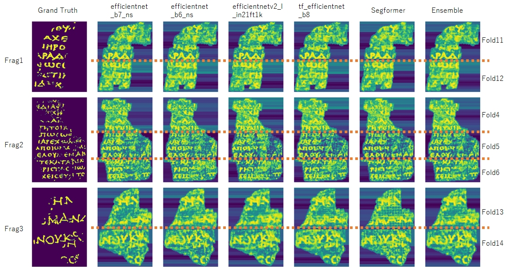

# kaggle Vesuvius Challenge - Ink Detection 6 th training code
This repository is designed to facilitate the execution of training code for the Kaggle Vesuvius Challenge.

th 0.96, cv 0.740, public LB 0.81, private LB 0.66

| model                     | image size | kfold         | cv     | public LB | private LB | usemodels(kfold) for inference |
|---------------------------|------------|---------------|--------|-----------|------------|-------------------------------|
| efficientnet_b7_ns        | 608        | 7 + fulltrain | 0.712  | 0.80      | 0.64       | [4,5,6,10,11,12,13,14]        |
| efficientnet_b6_ns        | 544        | 7 + fulltrain | 0.702  | 0.79      | 0.64       | [4,5,6,10,11,12,13,14]        |
| efficientnetv2_l_in21ft1k | 480        | 7             | 0.707  | 0.79      | 0.65       | [4,5,6,11,12,13,14]           |
| tf_efficientnet_b8        | 672        | 7             | 0.716  | 0.79      | 0.64       | [4,5,6,11,12,13,14]           |
| segformer-b3              | 1024       | 7             | 0.738  | 0.78      | 0.66       | [4,5,6,11,12,13,14]           |

For one example, this is the quick start notebook on google colab [here](http://colab.research.google.com/github/chumajin/kaggle-VCID/blob/main/Quickstart_VCID_6th.ipynb).  

# 0. Environment

I created the models using Google Colab Pro+. For the efficientnetv2_l_in21ft1k model, I used a V100 GPU and high memory condition, while for the other models, I used an A100 GPU with high memory. So I recommend you the same environment.

In that case, at least you must install adder libraries as follows:
~~~
!pip install transformers==4.29.2
!pip install timm==0.9.2
!pip install segmentation_models_pytorch==0.3.3
~~~

In other cases, please refer to the requirement.txt file for further instructions.

* python : 3.10.12
* cuda : 12.0
* driver version 525.85.12

# 1. DataPreparation

The input data is required to have the following structure.

~~~
inputpath
    └── fragmentid
        ├── subvolume
        │   ├── 1.tif
        │   ├── 2.tif
        │   ├── 3.tif
        │   ├── ・・・
        │   └── 64.tif
        ├── mask.png
        ├── ir.png
        └── inklabels.png
~~~

If you want to use the competition data, you can download the compressed data using the Kaggle API through your kaggle.json file. 

~~~
import os
import json

inputpath = "*****" # change path you want to download
os.makedirs(inputpath,exist_ok=True)

kaggle_path = "*****/kaggle.json" # you must change this for your own
f = open(kaggle_path, 'r')
json_data = json.load(f)
os.environ['KAGGLE_USERNAME'] = json_data['username']
os.environ['KAGGLE_KEY'] = json_data['key']

## download dataset

!kaggle datasets download -d chumajin/vcid-light-dataset
!unzip vcid-light-dataset.zip -d $inputpath
~~~

For google colab, once you save to google drive, you will not need this download next time.

If you use an original data, you set the inputpath as above.
Afterwards, it will be compressed to uint8 format using preprocess.py.
Note that, this overwrites the images in inputpath.
In the competition, the data was compressed to uint8 format, but the accuracy difference is not significant, so preprocessing may not be necessary if you did not.

~~~
python preprocess.py \
--inputpath {inputpath}
~~~

# 2. Select model and fold

The following training code makes only one model weight per model per fold. Please specify the model and fold you would like to use.
※ fulltrain is fold 10.

| model                     | image size | kfold         | cv     | public LB | private LB | usemodels(kfold) for inference |
|---------------------------|------------|---------------|--------|-----------|------------|-------------------------------|
| efficientnet_b7_ns        | 608        | 7 + fulltrain | 0.712  | 0.80      | 0.64       | [4,5,6,10,11,12,13,14]        |
| efficientnet_b6_ns        | 544        | 7 + fulltrain | 0.702  | 0.79      | 0.64       | [4,5,6,10,11,12,13,14]        |
| efficientnetv2_l_in21ft1k | 480        | 7             | 0.707  | 0.79      | 0.65       | [4,5,6,11,12,13,14]           |
| tf_efficientnet_b8        | 672        | 7             | 0.716  | 0.79      | 0.64       | [4,5,6,11,12,13,14]           |
| segformer-b3              | 1024       | 7             | 0.738  | 0.78      | 0.66       | [4,5,6,11,12,13,14]           |

# 3. Execute training

When you make a model weight by the kaggle competition condition, please run the following code. The model weight will be created inside the savepath as 'model{foldnum}.pth'. If you provide a folder name as savepath, a folder will be created automatically. If you use google colab, I recommend the savepath in the google drive because the file will remove when the session is out. 

~~~
python train.py \
--model {modelname} \
--fold {foldnum} \
--savepath {savepath} \
--inputpath {inputpath}
~~~

example using above competition data:
In this case, ./output folder will make and the model weight will save in it as model14.pth.

~~~
python train.py \
--model efficientnet_b7_ns \
--fold 14 \
--savepath output \
--inputpath $inputpath
~~~

If your GPU memory is 40GB or less, please modify the learning rate and batch size with the following codes.
Note that this will change the accuracy.
Default lr and batch size is in condition.csv, which was used for the competition. 

~~~
--changelr True \
--lr {lr} \
--changebatch True \
--trainbatch {train_batch} \
--validbatch {valid_batch} \
~~~

Futhermore, if you want to use an original data, you should choose validation fragment id. In that case, train data are other fragment ids.
~~~
--originalvalidid {fragmentid}
~~~

And if you don't have ir images, you must change --useir False as follows.
~~~
--useir False
~~~

example of original data:

~~~
python train.py \
--model efficientnet_b7_ns \
--fold 11 \
--savepath output \
--inputpath $inputpath \
--changelr True \
--lr 0.0001 \
--changebatch True \
--trainbatch 4 \
--validbatch 8 \
--originalvalidid 1 \
--useir False
~~~

# 4. Inference

For kaggle competition, you can use the inference code on the kaggle notebook [here](https://www.kaggle.com/code/chumajin/vcid-6th-place-inference). Train the necessary k-folds and create the models within a single folder. Then, upload them to Kaggle and please edit the modelpath in the CFG for each model accordingly.

Otherwise, you can use the inference.py as follows.
(Note that, this is a different code from the kaggle notebook. Because the kaggle test data, which devide the test fragment "a" and "b" from one fragment, is special for the kaggle competitions.)

~~~
python inference.py --model {modelname} \
--modelpath {modelpath} \ # foldername in which models are saved.
--usemodels {usemodels} \ # usemodels(kfold)
--savepath {savepath} \ # output path
--inputpath {inputpath} \
--th {threshold} \ # threshold to make binary
--rotation {True/False} # rotation True is 90 degree rotation.
~~~

example:

~~~
python inference.py --model efficientnet_b7_ns  \
--modelpath output \ 
--usemodels 4 5 6 10 11 12 13 14 \ 
--savepath . \
--inputpath . \
--th 0.96 \
--rotation True # rotation True is 90 degree rotation.
~~~

In this case, prediction will make in the savepath as the maskpred_{fragmentid}.npy (raw prediction) and maskpred_bin_{fragmentid}.npy (binary by threshold).

# 5. license

The code in this repository is MIT lisence, but the pre-training model and libraries used is under the license of the major source. For example, segformer is licensed under nvidia [here](https://github.com/NVlabs/SegFormer/blob/master/LICENSE).

